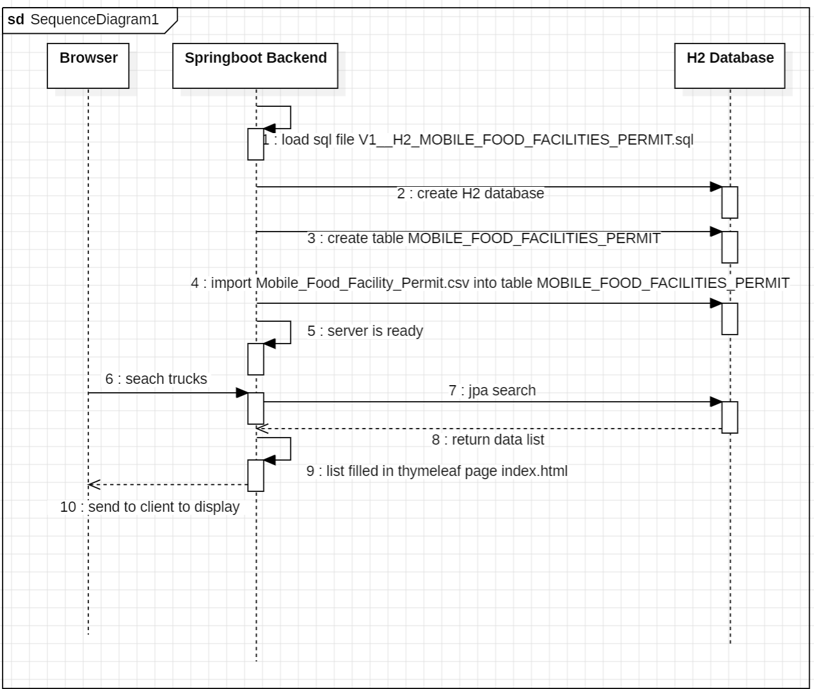

## Challenge from -> https://github.com/peck/engineering-assessment


## How to run it?
1. Install jdk17
   1. install jdk17 on your computer https://www.oracle.com/cn/java/technologies/downloads/#jdk17-windows
   2. use below command to check your jdk version
       ```
       java --version
       ```
   3. add your jdk17 path into environment variable 'path' if previous step fails
2. Install maven https://maven.apache.org/download.cgi
   1. check your maven version
       ```
       mvn -v
       ```
   2. add your maven_path/bin into environment variable 'path' if previous step fails
3. download or git clone the code https://gitee.com/cingpo/example-food-truck-search.git
4. open a terminal and cd to the code's directory
5. make the jar package
   ```
   mvn clean package
   ```
6. check the 'target' folder, you should be able to find file foodtruck-0.0.1-SNAPSHOT.jar
7. run the jar file
   ```
   cd target
   java -jar foodtruck-0.0.1-SNAPSHOT.jar
   ```
8. open url in a browser: http://localhost:8080/
   

## Sequence Diagram


## Important Files
| File                           |                   Description       | Path |
| ------------------------------ | ---------------------------------   | ----------- |
| Mobile_Food_Facility_Permit.csv| will be imported into H2 database   |src\main\resources|
| index.html   | frontend search page  | src\main\resources\templates  |
| V1__H2_MOBILE_FOOD_FACILITIES_PERMIT.sql | flyway db migration | src\main\resources\db\migration\h2 |
| FoodtruckApplication.java | Main Class | src\main\java\com\cingpo\foodtruck |
| FoodtruckController.java | Controller | src\main\java\com\cingpo\foodtruck\controller |
| MobileFoodFacilityServiceImpl.java | Service | src\main\java\com\cingpo\foodtruck\service\impl |
| MobileFoodFacilityRepository.java | Repository | src\main\java\com\cingpo\foodtruck\repository |
| MobileFoodFacilityEntity.java | Entity | src\main\java\com\cingpo\foodtruck\model |

## Future Plan

I think I missed something. San Francisco's food truck open dataset has alreay provided an API for data search. I don't need to develop the backend API. Importing the cvs into H2 to provide a backend API took me a lot of time, which didn't leave me with much time to implement more frontend functionalities.


#### If there is a V2, I maybe make below changes
* remove H2 and java backend service, use open dataset API directly
* provide more search conditions in the front page, like states, address, status etc.
* add a new google map page to display truck location

#### If there is a V3
* Develop a mobile app
* Users can search by phone directly
* Every truck has a score which depends on users' comments.
* The app will give suggestions to users for food
* Trucks can advertise on the app 

