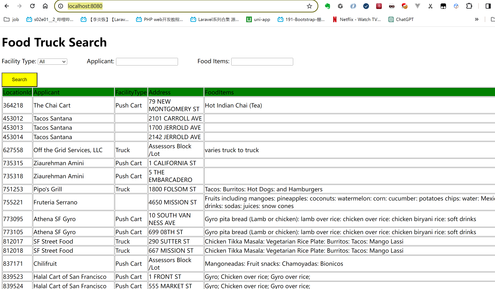

## Challenge from$\rightarrow$https://github.com/peck/engineering-assessment


# Getting Started

### How to run it?
1. Install jdk17
   1. install jdk17 on your computer https://www.oracle.com/cn/java/technologies/downloads/#jdk17-windows
   2. use below command to check your jdk version
       ```
       java --version
       ```
   3. add your jdk17 path into environment variable 'path' if previous step fails
2. Install maven https://maven.apache.org/download.cgi
   1. check your maven version
       ```
       mvn -v
       ```
   2. add your maven_path/bin into environment variable 'path' if previous step fails
3. download or git clone the code https://gitee.com/cingpo/example-food-truck-search.git
4. open a terminal and cd to the code's directory
5. make the jar package
   ```
   mvn clean package
   ```
6. check the 'target' folder, you should be able to find file foodtruck-0.0.1-SNAPSHOT.jar
7. run the jar file
   ```
   cd target
   java -jar foodtruck-0.0.1-SNAPSHOT.jar
   ```
8. open url in a browser: http://localhost:8080/
   

### Layout
The following guides illustrate how to use some features concretely:

* [Building a RESTful Web Service](https://spring.io/guides/gs/rest-service/)
* [Serving Web Content with Spring MVC](https://spring.io/guides/gs/serving-web-content/)
* [Building REST services with Spring](https://spring.io/guides/tutorials/rest/)
* [Handling Form Submission](https://spring.io/guides/gs/handling-form-submission/)

